# TP 3 – Gestion des Réservations

## 🔗 Lier Salle – Réservation – Utilisateur  
## ➕ Ajouter Équipement (ManyToMany)  
## 🔁 Expérimenter Cascade & Suppression Orpheline  

---

## 🎯 Objectif du TP

L’objectif de ce TP est de mettre en place un système de gestion des réservations en utilisant JPA et Hibernate.

Ce travail consiste à :

- Créer et lier les entités Salle, Réservation et Utilisateur
- Ajouter une nouvelle entité Équipement
- Implémenter une relation ManyToMany
- Expérimenter les opérations en cascade
- Tester la suppression orpheline (orphanRemoval)
- Observer les requêtes SQL générées automatiquement

---

## 🛠️ Technologies utilisées

- Java 8  
- Maven  
- JPA (Java Persistence API)  
- Hibernate  
- Base de données H2 (en mémoire)  
- Hibernate Validator  
- SLF4J  

---

## ⚙️ Configuration du projet

Le projet est configuré avec :

- Maven pour la gestion des dépendances  
- Une base de données H2 en mémoire  
- Génération automatique des tables  
- Affichage des requêtes SQL dans la console  

# 🏗️ Modèle de Données

Le système repose sur quatre entités principales :

## 👤 Utilisateur
Représente une personne qui effectue des réservations.

Un utilisateur peut avoir plusieurs réservations.

---

## 🏢 Salle
Représente une salle pouvant être réservée.

Une salle peut contenir plusieurs équipements.  
Une salle peut avoir plusieurs réservations.

---

## 📅 Réservation
Représente la réservation d’une salle par un utilisateur à une période donnée.

Chaque réservation est liée :
- À un utilisateur
- À une salle

---

## 🖥️ Équipement
Représente le matériel disponible dans une salle (projecteur, écran, etc.).

Un équipement peut être utilisé dans plusieurs salles.

---

📸 Diagramme de classe UML :
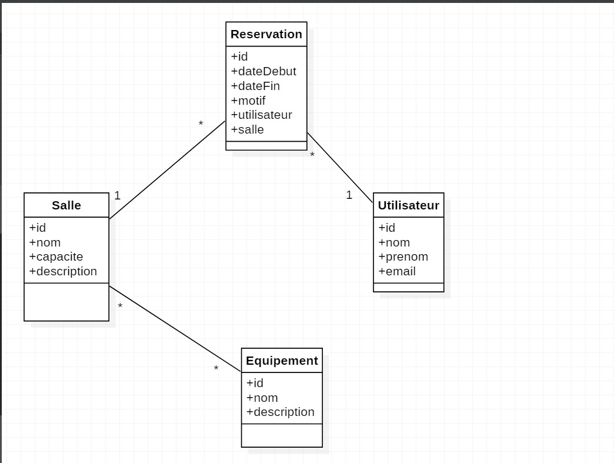

---

# 🔗 Relations Implémentées

## 1️⃣ Utilisateur – Réservation

Relation OneToMany.

- Lorsqu’un utilisateur est sauvegardé, ses réservations sont automatiquement sauvegardées (cascade).
- Si une réservation est supprimée de la liste de l’utilisateur, elle est automatiquement supprimée de la base de données (suppression orpheline).

---

## 2️⃣ Salle – Réservation

Relation OneToMany.

Une salle peut contenir plusieurs réservations.

---

## 3️⃣ Salle – Équipement

Relation ManyToMany.

- Une salle peut contenir plusieurs équipements.
- Un équipement peut appartenir à plusieurs salles.
- Une table intermédiaire est générée automatiquement.

---

#  Tests Réalisés

## ✅ Test des relations et cascade

- Création d’un utilisateur
- Création d’une salle
- Création d’une réservation
- Liaison des entités
- Persistance automatique grâce à la cascade

📸 Console  : 
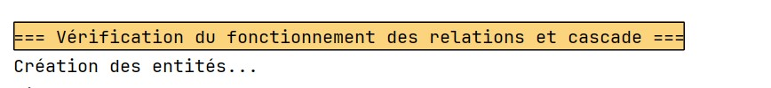

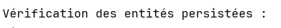

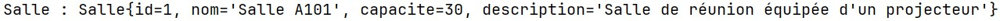
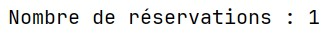

---

## ✅ Test de suppression orpheline

- Création d’un utilisateur avec deux réservations
- Suppression d’une réservation
- Vérification que la réservation est supprimée de la base

📸 Console  :  
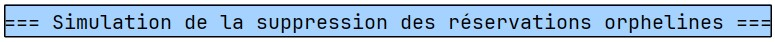
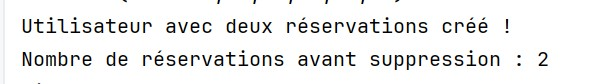
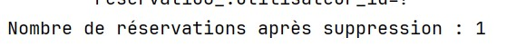
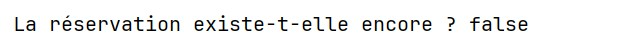

---

## ✅ Test relation ManyToMany

- Création de plusieurs équipements
- Association aux salles
- Vérification des relations
- Suppression d’un équipement d’une salle

📸 Console  :  
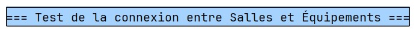
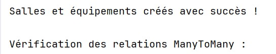

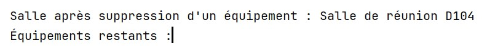
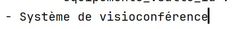

---

# 🗂️ Structure du Projet

📸 Arborescence  :  
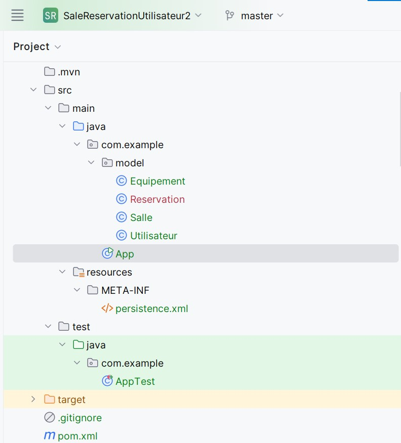

---

#  Exécution du Projet

1. Ouvrir le projet dans un IDE (IntelliJ ou NetBeans)
2. Lancer la classe principale
3. Observer :
   - Les requêtes SQL générées
   - Les opérations en cascade
   - La suppression orpheline
   - Les relations ManyToMany

---

# 📘 Conclusion

Ce TP m’a permis de comprendre :

- Le fonctionnement des relations en JPA
- La différence entre OneToMany, ManyToOne et ManyToMany
- L’utilité des opérations en cascade
- Le rôle de la suppression orpheline
- La gestion des relations bidirectionnelles
- La génération automatique des tables avec Hibernate

Toutes les fonctionnalités ont été testées et validées avec succès.